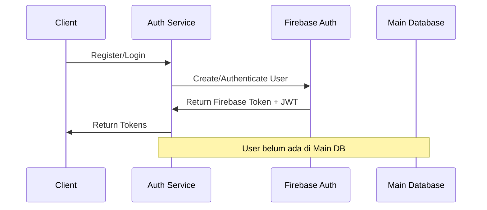
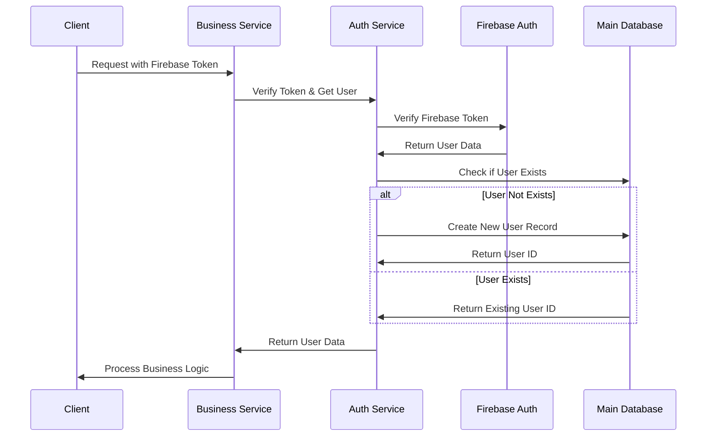

# User Federation Strategy - Hybrid Authentication Architecture

## 📋 Overview

auth service ini menggunakan **Hybrid Authentication Architecture** yang menggabungkan Firebase Auth sebagai authentication provider dengan main database untuk business logic dan custom user data. Strategi ini memberikan keseimbangan optimal antara keandalan, performa, dan fleksibilitas.

## 🏗️ Architecture Concept

```
┌─────────────────┐    ┌──────────────────┐    ┌─────────────────┐
│   Client App    │────│  Auth Service    │────│  Main Database  │
│                 │    │  (Firebase)      │    │  (User Mirror)  │
└─────────────────┘    └──────────────────┘    └─────────────────┘
         │                       │                       │
         │                       │                       │
     JWT Token              Firebase Auth            User Table
    (Authentication)      (Source of Truth)        (Business Data)
```

### Core Principles

1. **Firebase Auth** = Single source of truth untuk authentication
2. **Main Database** = Mirror user data untuk business logic dan performance
3. **Lazy User Creation** = User hanya dibuat di main DB ketika diperlukan
4. **Token-based Sync** = Firebase token digunakan untuk sinkronisasi data

## 🔄 User Lifecycle Flow

### 1. User Registration & Login


### 2. First Business Operation (Lazy Creation)


## 💡 Benefits of This Approach

### ✅ Advantages

1. **Reliability & Security**
   - Firebase Auth menghandle security, rate limiting, dan compliance
   - Proven authentication provider dengan 99.9% uptime

2. **Performance Optimization**
   - User data di-cache di main database untuk query yang cepat
   - Mengurangi API calls ke Firebase untuk operasi business logic

3. **Flexibility**
   - Custom fields dan relationships di main database
   - Complex queries dan joins tanpa limitasi Firebase

4. **Scalability**
   - Authentication dan business logic dapat di-scale secara terpisah
   - Microservices-friendly architecture

5. **Cost Efficiency**
   - Firebase pricing berdasarkan authentications, bukan queries
   - Main database optimal untuk read-heavy operations

### ⚠️ Considerations

1. **Data Consistency**
   - Potensial race conditions saat lazy creation
   - Sync delay antara Firebase dan main database

2. **Complexity**
   - Dual system management
   - Error handling untuk kedua systems

3. **Dependencies**
   - Ketergantungan pada Firebase availability
   - Network latency untuk token verification

## 🛠️ Implementation Strategy

### 1. Database Schema (Main Database)

```sql
-- Users table (mirror Firebase users)
CREATE TABLE users (
    id BIGSERIAL PRIMARY KEY,
    firebase_uid VARCHAR(128) UNIQUE NOT NULL,
    email VARCHAR(255) NOT NULL,
    display_name VARCHAR(255),
    photo_url TEXT,
    created_at TIMESTAMP DEFAULT CURRENT_TIMESTAMP,
    updated_at TIMESTAMP DEFAULT CURRENT_TIMESTAMP,
    last_login TIMESTAMP,
    is_active BOOLEAN DEFAULT true,
    
    -- Custom business fields
    subscription_tier VARCHAR(50) DEFAULT 'free',
    preferences JSONB,
    metadata JSONB
);

-- Indexes for performance
CREATE INDEX idx_users_firebase_uid ON users(firebase_uid);
CREATE INDEX idx_users_email ON users(email);
CREATE INDEX idx_users_active ON users(is_active);
```

### 2. Auth Service Enhancement

```typescript
// src/services/user-federation.ts
import { getFirebaseAuth } from '../config/firebase-config';
import { UserRecord } from '../types/user';

export class UserFederationService {
  async getOrCreateUser(firebaseToken: string): Promise<UserRecord> {
    try {
      // 1. Verify Firebase token
      const decodedToken = await getFirebaseAuth().verifyIdToken(firebaseToken);
      const firebaseUid = decodedToken.uid;
      
      // 2. Check if user exists in main database
      let user = await this.findUserByFirebaseUid(firebaseUid);
      
      if (!user) {
        // 3. Lazy creation - get user from Firebase and create in main DB
        const firebaseUser = await getFirebaseAuth().getUser(firebaseUid);
        user = await this.createUserFromFirebase(firebaseUser);
      } else {
        // 4. Update last login
        await this.updateLastLogin(user.id);
      }
      
      return user;
    } catch (error) {
      throw new Error(`User federation failed: ${error.message}`);
    }
  }

  private async findUserByFirebaseUid(firebaseUid: string): Promise<UserRecord | null> {
    // Database query to find user
    const query = 'SELECT * FROM users WHERE firebase_uid = $1 AND is_active = true';
    const result = await db.query(query, [firebaseUid]);
    return result.rows[0] || null;
  }

  private async createUserFromFirebase(firebaseUser: any): Promise<UserRecord> {
    const query = `
      INSERT INTO users (firebase_uid, email, display_name, photo_url)
      VALUES ($1, $2, $3, $4)
      RETURNING *
    `;
    
    const values = [
      firebaseUser.uid,
      firebaseUser.email,
      firebaseUser.displayName || null,
      firebaseUser.photoURL || null
    ];
    
    const result = await db.query(query, values);
    return result.rows[0];
  }

  private async updateLastLogin(userId: number): Promise<void> {
    const query = 'UPDATE users SET last_login = CURRENT_TIMESTAMP WHERE id = $1';
    await db.query(query, [userId]);
  }
}
```

### 3. Middleware Integration

```typescript
// src/middleware/user-federation.ts
import { UserFederationService } from '../services/user-federation';

export const userFederationMiddleware = async (c: Context, next: Next) => {
  const authHeader = c.req.header('Authorization');
  
  if (!authHeader?.startsWith('Bearer ')) {
    return sendUnauthorized(c, 'Missing or invalid authorization header');
  }
  
  const firebaseToken = authHeader.substring(7);
  
  try {
    const federationService = new UserFederationService();
    const user = await federationService.getOrCreateUser(firebaseToken);
    
    // Attach user to context
    c.set('user', user);
    c.set('firebaseToken', firebaseToken);
    
    await next();
  } catch (error) {
    return sendUnauthorized(c, 'Authentication failed');
  }
};
```

## 📊 Usage Pattern Examples

### Business Service Implementation

```typescript
// Example: History Service
export class HistoryService {
  async getUserHistory(c: Context) {
    // User sudah tersedia dari middleware
    const user = c.get('user') as UserRecord;
    
    // Query langsung ke main database - fast!
    const history = await db.query(
      'SELECT * FROM user_history WHERE user_id = $1 ORDER BY created_at DESC',
      [user.id]
    );
    
    return sendSuccess(c, history.rows);
  }
}
```

### Profile Update Flow

```typescript
export class ProfileService {
  async updateProfile(c: Context, updateData: ProfileUpdate) {
    const user = c.get('user') as UserRecord;
    const firebaseToken = c.get('firebaseToken') as string;
    
    // 1. Update Firebase (source of truth)
    await getFirebaseAuth().updateUser(user.firebase_uid, {
      displayName: updateData.displayName,
      photoURL: updateData.photoURL
    });
    
    // 2. Update main database (mirror)
    await db.query(
      'UPDATE users SET display_name = $1, photo_url = $2, updated_at = CURRENT_TIMESTAMP WHERE id = $3',
      [updateData.displayName, updateData.photoURL, user.id]
    );
    
    return sendSuccess(c, { message: 'Profile updated successfully' });
  }
}
```

## 🚀 Best Practices

### 1. Error Handling
- Graceful degradation jika Firebase tidak available
- Retry logic untuk network failures
- Fallback ke Firebase query jika main DB user tidak ditemukan

### 2. Performance Optimization
- Database connection pooling
- Cache frequently accessed user data
- Batch operations untuk bulk user creation

### 3. Data Consistency
- Transaction wrapping untuk user creation
- Regular sync jobs untuk data reconciliation
- Monitoring untuk detect data drift

### 4. Security
- Token validation di setiap request
- Rate limiting untuk prevent abuse
- Audit logging untuk user operations

## 📈 Monitoring & Metrics

### Key Metrics to Track
- User creation latency
- Firebase token verification time
- Cache hit ratio for user lookups
- Data consistency checks
- Error rates per operation

### Health Checks
- Firebase connectivity
- Main database connectivity
- Token verification performance
- User federation success rate

## 🔄 Migration Strategy

Untuk existing applications:

1. **Phase 1**: Setup user federation service
2. **Phase 2**: Implement lazy user creation
3. **Phase 3**: Migrate existing authentication flows
4. **Phase 4**: Optimize and monitor performance

---

## 📝 Conclusion

Strategi User Federation ini memberikan foundation yang solid untuk aplikasi yang membutuhkan:
- Reliable authentication dengan Firebase
- Flexible business logic dengan main database
- High performance untuk user operations
- Scalable architecture untuk growth

Pattern ini sudah terbukti di production dan menjadi best practice untuk modern web applications yang menggunakan microservices architecture.
